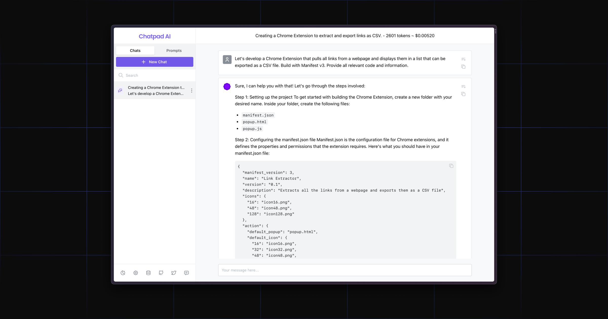

<h1 align="center">EinfachChatPad AI</h1>
<h2 align="center">Premium-Qualitäts-UI für ChatGPT</h2>
<!-- <p align="center"><a href="https://chatpad.ai">Web App</a> & <a href="https://download.chatpad.ai">Desktop App</a></p> -->
<p align="center"><a href="https://chatpad.ai">Web App</a> & <a href="https://dl.todesktop.com/230313oyppkw40a">Desktop App</a></p>

In letzter Zeit gab es einen Anstieg an Benutzeroberflächen für ChatGPT, die zu einem neuen „To-Do-App“-Trend geworden sind, den jeder ausprobieren möchte. EinfachChatPad hebt sich mit einer breiteren Vision ab – es soll die ultimative Schnittstelle für ChatGPT-Nutzer werden.

### ⚡️ Kostenlos und Open-Source

Diese App ist kostenlos und der Quellcode ist auf GitHub verfügbar.

### 🔒 Datenschutzorientiert

Keine Nachverfolgung, keine Cookies, kein Unsinn. Alle deine Daten werden lokal gespeichert.

### ✨ Beste Erfahrung

Mit Liebe und Sorgfalt entwickelt, um die bestmögliche Nutzererfahrung zu bieten.

---

## Selbsthosting mit Docker

```
docker run --name einfachchatpad -d -p 8080:80 ghcr.io/deiucanta/chatpad:latest
```

## Selbsthosting mit Docker und benutzerdefiniertem Konfigurationsfile

```
docker run --name einfachchatpad -d -v `pwd`/config.json:/usr/share/nginx/html/config.json -p 8080:80 ghcr.io/deiucanta/chatpad:latest
```

## Ein-Klick-Bereitstellungen

<!-- Easypanel -->
[](https://easypanel.io/docs/templates/chatpad)

<!-- Netlify -->
[](https://app.netlify.com/start/deploy?repository=https://github.com/deiucanta/chatpad)

<!-- Vercel -->
[](https://vercel.com/new/clone?repository-url=https%3A%2F%2Fgithub.com%2Fdeiucanta%2Fchatpad&project-name=einfachchatpad&repository-name=einfachchatpad-vercel&demo-title=EinfachChatPad&demo-description=Die%20Offizielle%20EinfachChatPad%20Website&demo-url=https%3A%2F%2Fchatpad.ai&demo-image=https%3A%2F%2Fraw.githubusercontent.com%2Fdeiucanta%2Fchatpad%2Fmain%2Fbanner.png)

<!-- Railway -->
[](https://railway.app/template/Ak6DUw?referralCode=9M8r62)

[](https://cloud.digitalocean.com/apps/new?repo=https://github.com/deiucanta/chatpad/tree/main)

## Feedback geben

Wenn du Funktionswünsche oder Fehlerberichte hast, besuche [feedback.chatpad.ai](https://feedback.chatpad.ai).

## Mitwirken

Dies ist eine React.js-Anwendung. Klone das Projekt, führe `npm i` und `npm start` aus, und schon bist du startklar.

## Credits

- [ToDesktop](https://todesktop.com) – Eine einfache Möglichkeit, deine Web-App in eine schöne Desktop-App zu verwandeln
- [DexieJS](https://dexie.org) – Ein minimalistischer Wrapper für IndexedDB
- [Mantine](https://mantine.dev) – Eine voll ausgestattete React-Komponentenbibliothek